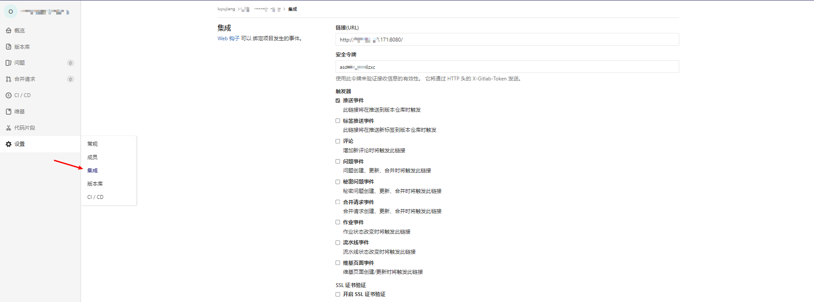

# Introduction

此工程为工作上调研Tekton时的记录。
此工程包含的yaml能完整的实现`gitlab提交->触发trigger->执行pipelinerun(构建镜像->推送harbor->deploy k8s)`一个tekton的经典应用场景

## tekton-test工程目录结构

```none
- resource
    |- serviceaccount.yaml
    |- 
- tasks
    |-
    |-
- pipeline
    |- build-pipeline.yaml  //pipeline
- run
    |- run.yaml   //pipelinerun
- trigger
    |- 
```

# Usage

1. tekton安装

    安装tekton pipelines
    参考文档：[installing-tekton-pipelines-on-kubernetes](https://github.com/tektoncd/pipeline/blob/main/docs/install.md#installing-tekton-pipelines-on-kubernetes)

    ```none
    # kubectl apply --filename https://storage.googleapis.com/tekton-releases/pipeline/latest/release.yaml
    ```

    安装tekton dashboard
    doc/tekton_dashboard_release_custom.yaml中Service部分给出了一个NodePort的示例，可供参考，按需配置即可

    ```none
    # wget https://github.com/tektoncd/dashboard/releases/latest/download/tekton-dashboard-release.yaml
    # kubectl apply -f tekton-dashboard-release.yaml
    ```

    安装tkn命令(tekton的client)

    ```none
    # rpm -Uvh https://github.com/tektoncd/cli/releases/download/v0.21.0/tektoncd-cli-0.21.0_Linux-64bit.rpm
    ```

    trigger安装

    ```none
    # kubectl apply --filename https://storage.googleapis.com/tekton-releases/triggers/latest/release.yaml
    # kubectl apply --filename https://storage.googleapis.com/tekton-releases/triggers/latest/interceptors.yaml
    ```

2. 创建所需资源

    ```none
    第一部分，主要是trigger所需的secret、sa、以及授权
    # kubectl apply -f resource/gitlab-user-pass.yaml
    # kubectl apply -f resource/gitlab-token.yaml
    # kubectl apply -f resource/triggers-rbac.yaml
    

    第二部分，主要是pipelinerun执行时所需的secret、sa、以及授权
    //gitlab-user-pass为共用，可以不重复执行
    # kubectl apply -f resource/gitlab-user-pass.yaml  

    //创建用于push image的harbor认证docker-config
    # kubectl create secret docker-registry dockerhub --docker-server=harbor.domain.com:8443 --docker-username=vxxxl --docker-password=3xxxxL --dry-run=client -o json | jq -r '.data.".dockerconfigjson"' | base64 -d > /tmp/config.json && kubectl create secret generic docker-config --from-file=/tmp/config.json;rm /tmp/config.json

    # kubectl apply -f resource/pipelinerun-rbac.yaml
    ```

3. 创建task/pipeline

    ```none
    1、git-clone实际上来自tkn hub, 如果能集群能正常访问gcr.io, 可以直接
       # tkn hub install task git-clone
       但如果集群无法访问gcr.io, 可以在<https://hub.tekton.dev/tekton/task/git-clone>把yaml下以下，改成自己的harbor地址
       # kubectl apply -f tasks/git-clone.yaml
    2、
        # kubectl apply -f tasks/build-and-push.yaml
    3、
        # kubectl apply -f pipeline/build-and-push-pipeline.yaml
    ```

    PS. 如果不使用trigger触发，想直接运行pipeline，可以直接：

    ```none
    # kubectl apply -f run/run.yaml
    ```

4. 创建triggerbinding/triggertemplate

    ```none
    # kubectl apply -f triggers/triggerBinding.yaml
    # kubectl apply -f triggers/triggerTemplate.yaml
    ```

5. 创建eventlistener

    PS. 这里使用集群的LB来暴露eventListener, 其他更多可以方式可以参考：<https://github.com/tektoncd/triggers/blob/main/docs/eventlisteners.md#exposing-an-eventlistener-using-a-loadbalancer-service>
    只要保证你的gitlab仓库机器能请求到eventlistener的地址就好

    ```none
    # kubectl  apply -f triggers/eventListener.yaml
    ```

6. gitlab仓库配置webhook
    此处填写的是eventlistener的地址，以及gitlab-token.yaml中定义的token
    

7. 查看执行结果

    ```none
    # kubectl  get pods     
    NAME                                                  READY   STATUS      RESTARTS   AGE
    build-and-push-pipelinerun-qv4jg-build-and-push-pod   0/1     Completed   0          26m
    build-and-push-pipelinerun-qv4jg-fetch-from-git-pod   0/1     Completed   0          26m
    ```

# 调研tekton的一些笔记

待补充

每个task应当都是可以被复用的


https://github.com/tektoncd/pipeline/blob/main/docs/tutorial.md


大致的变量传递的逻辑
pipelineResource
```none
  pipelinerun的resource，必须是已经创建过的同名pipelineResource，要么就直接写一个resourceSpec现创一个
  
  pipeline也同理。 
  不过pipeline中的resource主要是为了传到task里面去。
  传入task时，resources.input.name可以随意取，他想表达的意思只是这个resource是已定义的git-repo

  task中的就必须name就必须是resources.input.name了。
```
params

tekton和deploy不在一个集群？


# Other

针对无法访问gcr.io的情况, 相关安装yaml在doc/下, 都已修改为自建harbor地址。
传到自建harbor的方法：待补充

我本地pv建来测试的比较小，如果因为上个pr失败导致未释放，可以操作一下如下：

```none
# kubectl patch pv pv001 -p '{"spec":{"claimRef": null}}' 
```
